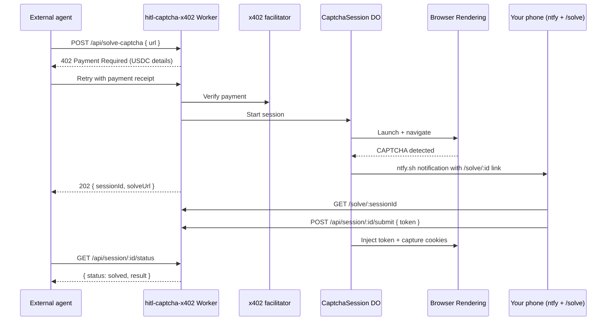

# Human-in-the-Loop CAPTCHA Solver (x402)

A Cloudflare Worker that gates CAPTCHA solving behind [x402](https://docs.cdp.coinbase.com/x402/welcome) USDC payments, spins up a headless browser with [Browser Rendering](https://developers.cloudflare.com/browser-run/), notifies your phone via [ntfy.sh](https://ntfy.sh), and hands the challenge to a mobile-friendly solve page.

## What it demonstrates

- **x402 payment gating** on `POST /api/solve-captcha` (HTTP 402 + `PAYMENT-REQUIRED` until a valid USDC receipt is supplied)
- **CDP facilitator + Bazaar discovery** metadata via `@x402/extensions/bazaar` (see [x402 Bazaar](https://docs.cdp.coinbase.com/x402/bazaar))
- **Cloudflare Browser Rendering** via `@cloudflare/puppeteer` and the `MYBROWSER` binding
- **Human handoff** with a durable session, server-rendered mobile solve UI, and token injection back into the headless browser
- **ntfy.sh push** so you can tap a notification on your phone and solve immediately

## Architecture



## Running locally

```sh
cd examples/hitl-captcha-x402
cp .env.example .dev.vars
```

Set these values in `.dev.vars`:

- `SERVER_ADDRESS` — Ethereum address to receive x402 payments (Base Sepolia: `eip155:84532`)
- `NTFY_TOPIC` — ntfy.sh topic you subscribe to on your phone
- `CDP_API_KEY_ID` / `CDP_API_KEY_SECRET` — [CDP API keys](https://docs.cdp.coinbase.com/x402/quickstart-for-sellers) for the recommended facilitator and Bazaar indexing

Then:

```sh
pnpm install
pnpm dev
```

Subscribe to your ntfy topic on your phone (ntfy app or `https://ntfy.sh/your-topic`).

## Deploy

```sh
pnpm run deploy
wrangler secret put SERVER_ADDRESS
wrangler secret put CDP_API_KEY_ID
wrangler secret put CDP_API_KEY_SECRET
pnpm run deploy --var "NTFY_TOPIC:your-ntfy-topic"
```

Without CDP API keys the worker falls back to the signup-free `x402.org` testnet facilitator. **Bazaar discovery indexing requires the CDP facilitator** and at least one successful settlement — see the [Bazaar seller guide](https://docs.cdp.coinbase.com/x402/bazaar#seller-integration).

`wrangler.jsonc` is the canonical config in this monorepo. `wrangler.toml` is included as an equivalent TOML copy.

Pass `NTFY_TOPIC` at deploy time (or set in `wrangler.jsonc` vars for local dev) so your phone topic does not need to be committed.

## End-to-end verification

See **[E2E-VERIFICATION.md](./E2E-VERIFICATION.md)** for the full live proof checklist:

- Deploy + ntfy phone setup
- x402 payment via [CDP CLI](https://docs.cdp.coinbase.com/get-started/build-with-ai/cdp-cli/quickstart) (`scripts/pay-and-solve.sh`)
- Real CAPTCHA targets (hCaptcha / reCAPTCHA demos — not Turnstile test keys)
- Troubleshooting (failed injection, 402, workers.dev subdomain)
- Verified session results

Quick paid trigger:

```sh
export CDP_KEY_ID=... CDP_KEY_SECRET=... CDP_WALLET_SECRET=...
chmod +x scripts/pay-and-solve.sh
./scripts/pay-and-solve.sh https://your-worker.workers.dev https://accounts.hcaptcha.com/demo
```

## API

### `POST /api/solve-captcha`

Paid endpoint. Without a valid x402 payment receipt, responds with **HTTP 402** and USDC payment requirements.

```json
{
  "url": "https://example.com/login",
  "wait": false,
  "callbackUrl": "https://your-agent.example/hooks/captcha-solved"
}
```

- `wait: true` — blocks up to 5 minutes until the human solves the challenge
- `callbackUrl` — optional webhook when the session completes

Response (async mode):

```json
{
  "sessionId": "abc123",
  "status": "awaiting_human",
  "solveUrl": "https://your-worker.dev/solve/abc123",
  "challenge": {
    "kind": "turnstile",
    "siteKey": "0x...",
    "pageUrl": "https://example.com/login",
    "pageTitle": "Login"
  }
}
```

### `GET /solve/:sessionId`

Server-rendered mobile solve page. Touch-friendly HTML renders the detected widget (Turnstile, reCAPTCHA, or hCaptcha) and posts the token back to the worker.

### `GET /`

Service metadata, x402 payment settings, and Bazaar discovery status.

### `GET /api/session/:sessionId/status`

Poll session state and retrieve the auth payload when solved.

### `POST /api/session/:sessionId/submit`

Submit a CAPTCHA token from the mobile page (normally called automatically by the solve UI).

## Auth payload

When solved, the service returns cookies, storage, and the final URL from the headless browser session:

```json
{
  "cookies": [{ "name": "session", "value": "...", "domain": ".example.com" }],
  "localStorage": {},
  "sessionStorage": {},
  "finalUrl": "https://example.com/dashboard",
  "userAgent": "Mozilla/5.0 ..."
}
```

## Related examples

- [`x402`](../x402/) — HTTP payment gating with Hono middleware
- [`browser-live-view`](../browser-live-view/) — human browser handoff via Live View
- [`guides/human-in-the-loop`](../../guides/human-in-the-loop/) — narrative HITL patterns with the Agents SDK
